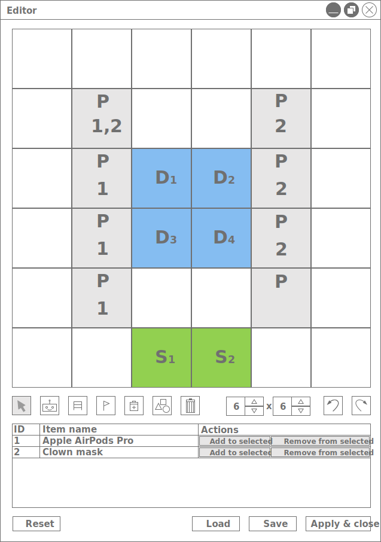

# Wireframe mockup
<figure>
    
    <figcaption>A főablak terve az adatok betöltése előtt</figcaption>
</figure>

<figure>
    
    <figcaption>A főablak terve az adatok betöltése után</figcaption>
</figure>

<figure>
    
    <figcaption>A főablak terve egy szimuláció közben</figcaption>
</figure>

<figure>
    
    <figcaption>A szerkesztő ablak terve</figcaption>
</figure>

